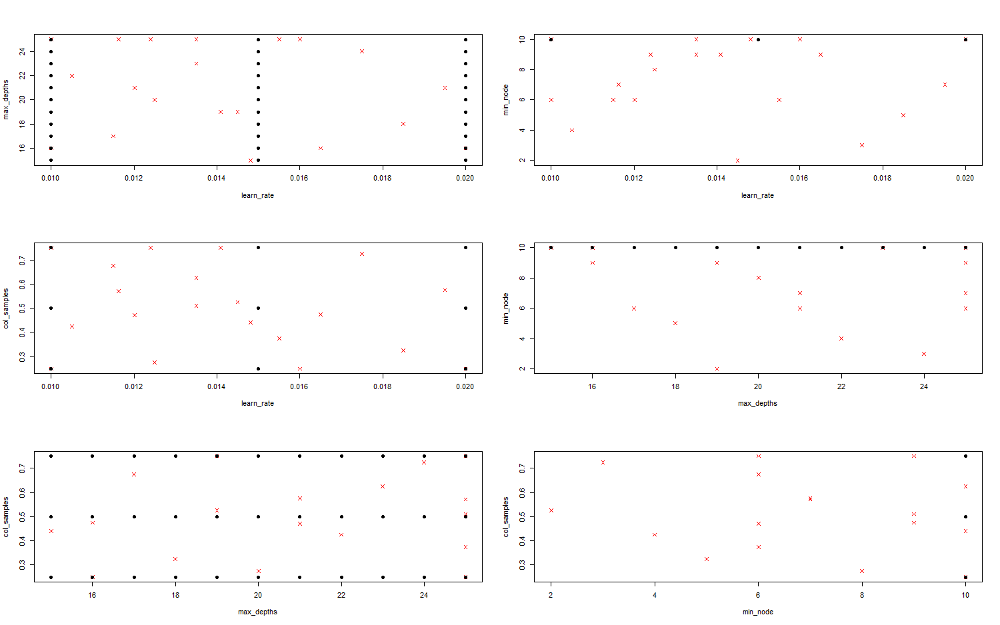
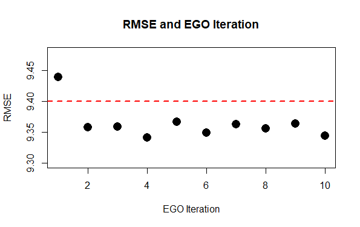

## Introduction/Background
Experimental design is a crucial part of any statistical experiment. This includes computer experiments, where we develop some predictive machine learning (ML) model trained on a real dataset, with the predictive performance of the model serving as the response and the various hyperparameters serving as different treatments. A common theme throughout many computational research papers that apply statistical and machine learning techniques, particularly in research in other fields where the statistical methodology or novelty is not the central insight, is that the authors implement an exhaustive, inefficient grid search to find the "best" model hyperparameters -- those which yield the most optimal predictive performance. However, this approach can be very computationally expensive, both in terms of model run times and computing resources. Moreover, choosing hyperparameters in this way does not attempt to describe or account for the relationships between overall model performance and hyperparameter choices. We would like to address these shortcomings in our analysis by combining smart computer experimental design with Bayesian optimization frameworks to efficiently tune hyperparameters of ML models in a more rigorous, statistically informed way.

For this project, we keep a few key goals in mind. First of all, we would like to achieve better predictive performance than what was reported in each of the individual papers, which are geared towards computational physics and chemistry and not super statistically fine-tuned for the utmost optimal model results. Secondly, we look to reduce the estimated run time to save on computational resources. And lastly, we seek to produce a systematic framework with which one can continually improve model performance. As for our methodology, we incorporate principles of computer experiment design — including the use of advanced experimental designs such as Latin Hypercube Sampling (LHS) and Maximum Projection Designs – in conjunction with Bayesian optimization algorithms leveraging Gaussian Process (GP) modeling, with more details presented in the following sections.

We apply this approach to regression modeling problems found in computational research papers published in physical sciences journals, comparing their methodologies and final model results to those of our analysis. In these papers, the authors use a common method: XGBoost (Chen et al. 2016); For a quick description of the model parameters see (Chen et al. 2018a). In addition, we show the results of using our methodology to tune the hyperparameters of XGBoost models on a common benchmark ML dataset to compare the effectiveness of our hyperparameter choices versus well-known baseline performance levels.

## Critical Temperatures of Superconductors
The first paper we analyze is “A Data-Driven Statistical Model for Predicting the Critical Temperature of a Superconductor”, published in the Journal of Computational Material Science. The author’s objective in this first paper is to predict at which temperature amaterial becomes a superconductor. A good use case for modeling this relationship is to pre-screen various compounds and find their critical temperatures. There is currently no widely accepted physical theory for the critical temperature of a superconductor, so using a statistical model is a good alternative to model the behavior.[^1]

[^1]: A superconductor is classified as any material which can transport electric charge with no resistance or with no energy loss.

In the dataset that the author used and provided, the outcome variable is the critical temperature and the predictor variables are various physical properties of the material, such as atomic mass, atomic radius, etc. The data has 21,263 observations in total with 82 columns. For their analysis, the author conducted an exhaustive 198-point grid search over five hyperparameters: learning rate, column subsampling, row subsampling, minimum
nodes, and maximum depth (Table 1). This amounts to taking all possible combinations of their chosen level settings. For performance evaluation, they used a 25-fold Monte Carlo
cross-validation (CV) using root mean square error (RMSE) as the performance metric. For each iteration they split the data in two thirds for model fitting and one third for model
evaluation.

::: {.table-narrow style="width: 70%; margin: auto;"}
| Parameters         | Levels              |
|--------------------|---------------------|
| Learning rate      | 0.010, 0.015, 0.020 |
| Column subsampling | 0.25, 0.50, 0.75    |
| Subsample ratio    | 0.5                 |
| Minimum nodes      | 1, 10               |
| Maximum depth      | 15, 16, ..., 25     |

**Table 1: Superconductors Hyperparameter Levels**

:::
 

For our analysis, we construct a Maximum Projection Latin Hypercube with 10 data points (using the MaxPro package in R) and use the same evaluation procedure as the author of the original paper. To transform samples from our design to integers, for discrete hyperparameters such as maximum depth (number of leaves) of trees, we apply the samples to the inverse CDF of the uniform distribution and take the ceiling of the resulting values. To transform the continuous hyperparameters from our design into the appropriate range we can simply shift them by a linear transformation. (We repeat this procedure for all three papers.)

We can visualize the comparison of all two-dimensional projections of the design that we generate and the design used by the author (Figure 1). From the plots we can see that the author’s design is not space filling in all of its projections, however our design does enjoy nice space filling and projection properties. Some of the projections of the author’s design are absurd, such as the max depth and min node - discrete parameters - which project as a continuous line. Although some of the author’s parameters are uniformly distributed, like maximum depth, this is not the case for all of their parameters, especially for the continuous parameters like learning rate.

*Figure 1:* Two-Dimensional Hyperparameter Projections. Author's Design in Black. Our Design in Red.

For the Gaussian Process (GP) Model, we use the Matern (5/2) covariance function with a small noise term added and linear mean functions. We introduce the noise term due to the fact that parameters like row and column subsampling are inherently random and lead to different performance evaluation. The estimated GP parameters can be seen in Table 2 and Table 3 below. Then, we run 10 iterations of the Expectation Globalization Optimization (EGO) algorithm. We can see from that after only a couple iterations, the gradient boosting model is performing at a lower RMSE than the author’s final reported value (Figure 2). In the end we arrive at an entirely different set of parameters than the author's set (Table 4). Further, the computation cost of running the model from start to finish is drastically reduced. In this instance, we are able to achieve better performance in approximately 1/10th of the run time for the author’s experiment. We estimate the author’s run time by taking the average run time on our 12 core desktop computer and multiplying by the number of configurations the author used to find hyperparamter values.

::: {.table-narrow style="width: 70%; margin: auto;"}
| Parameters         | Estimates           |
|--------------------|---------------------|
| (Intercept)        | 88.299              |
| Learning rate      | 1.532               |
| Subsample ratio    | 0.4                 |
| Minimum nodes      | -2.56               |
| Maximum depth      | 0.490               |

**Table 2: Gaussian Process Parameters: Trend Coefficients**

:::
 

::: {.table-narrow style="width: 70%; margin: auto;"}
| Parameters             | Estimates           |
|------------------------|---------------------|
| Theta(Learning rate)   | 0.455               |
| Theta(Subsample ratio) | 1.800               |
| Theta(Minimum nodes)   | 0.164               |
| Theta(Maximum depth)   | 1.800               |

**Table 3: Gaussian Process Parameters: Covariance**

:::
 

*Figure 2:* EGO Algorithm Results

::: {.table-narrow style="width: 70%; margin: auto;"}
|                    | Author's Results    | Our Results         |
|--------------------|---------------------|---------------------|
| Learning rate      | 0.016               | 0.029               |
| Subsample ratio    | 0.400               | 0.200               |
| Minimum nodes      | 10                  | 11                  |
| Maximum depth      | 16                  | 10                  |
| RMSE               | 44.090              | 41.911              |
| Estimated Runtime  | 2 hours             | 8 minutes           |

**Table 4: Final XGBoost Model Comparison**

:::
 

To be continued...

